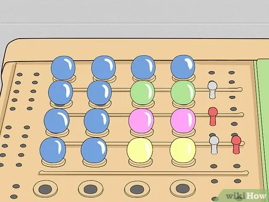

# Are You the One Simulation

    Basically mastermind, but the pegs are people.

## Rules of the Game:

    - A game starts with equal numbers of males and females (10 on the show).
    - Every turn, the player does two things:
        - guesses a single male/female pair, receives immediate yes/no
        - guesses a total lineup, recieves a number of matches
        - If the lineup is correct on or before the 10th turn, player wins

## Running the Simulation

    $ ruby game.rb

## Dependencies

    - Ruby
    - OpenStruct